# Chess App

A React Native chess application built with Expo, designed to provide an intuitive and engaging chess experience on mobile devices.

## Features

- 🎯 Modern React Native interface
- 📱 Cross-platform support (iOS, Android, Web)
- 🎨 Clean and intuitive UI/UX
- ⚡ Built with Expo for fast development

## Prerequisites

Before you begin, ensure you have the following installed:

- [Node.js](https://nodejs.org/) (version 16 or higher)
- [Expo CLI](https://docs.expo.dev/get-started/installation/)
- [Git](https://git-scm.com/)

## Installation

1. Clone the repository:
   ```bash
   git clone https://github.com/bricedurand/chess-app.git
   cd chess-app
   ```

2. Install dependencies:
   ```bash
   npm install
   ```

3. Start the development server:
   ```bash
   npm start
   ```

## Usage

### Running on Different Platforms

- **Web**: `npm run web`
- **iOS**: `npm run ios` (requires Xcode on macOS)
- **Android**: `npm run android` (requires Android Studio)

### Development

The app uses Expo for development, which provides:
- Hot reloading for instant feedback
- Easy device testing with Expo Go app
- Built-in debugging tools

## Project Structure

```
chess-app/
├── App.tsx              # Main application component
├── index.ts             # Entry point
├── package.json         # Dependencies and scripts
├── tsconfig.json        # TypeScript configuration
├── app.json             # Expo configuration
└── assets/              # Images and static assets
    ├── icon.png
    ├── splash-icon.png
    └── ...
```

## Class Diagram



The diagram source is maintained in [class-diagram.mmd](class-diagram.mmd).

To regenerate the SVG, PDF, or PNG from the Mermaid source, run:
```bash
mmdc -i class-diagram.mmd -o class-diagram.svg
mmdc -i class-diagram.mmd -o class-diagram.pdf
mmdc -i class-diagram.mmd -o class-diagram.png
```

## License

This project is licensed under the MIT License - see the [LICENSE](LICENSE) file for details.

## Acknowledgments

- Built with [React Native](https://reactnative.dev/)
- Powered by [Expo](https://expo.dev/)
- Chess logic and UI components

## Support

If you encounter any issues or have questions, please:
- Check the [Issues](https://github.com/bricedurand/chess-app/issues) page
- Create a new issue with detailed information

---

Made with ❤️ by [bricedurand](https://github.com/bricedurand)
