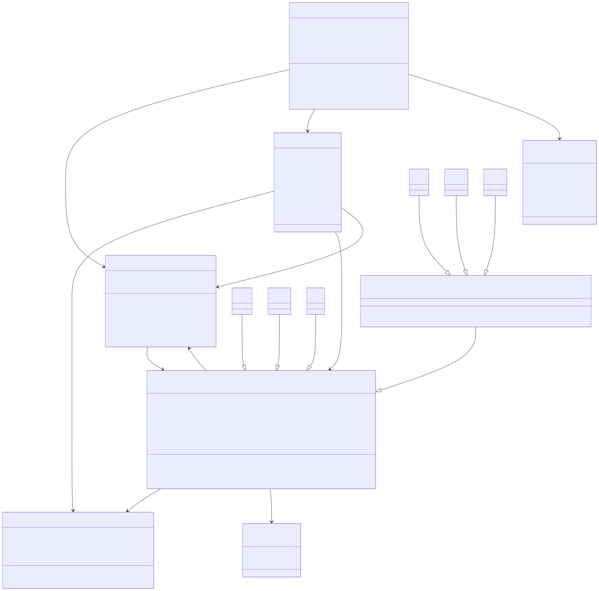

# Chess App

A monorepo chess application with shared core logic and multiple UI implementations (CLI, web, mobile, etc.).

## Architecture

This project uses a monorepo structure with shared chess logic and multiple UI clients:

- **`packages/core`**: Pure TypeScript chess engine (no dependencies)
- **`apps/`**: Different UI implementations that consume the core package
  - CLI (terminal/ASCII interface)
  - Future: FlutterFlow, React Native mobile app

## Project Philosophy

Inspired by [TodoMVC](https://todomvc.com/), this project demonstrates how the same chess logic can power different UI technologies. All game rules, move validation, and state management live in the core package, while each app provides its own user experience.

## Getting Started

### Prerequisites

- [Node.js](https://nodejs.org/) (version 16 or higher)
- [Git](https://git-scm.com/)

### Installation

1. Clone the repository:
   ```bash
   git clone https://github.com/bricedurand/chess-app.git
   cd chess-app
   ```

2. Install dependencies:
   ```bash
   npm install
   ```

3. Build the core package:
   ```bash
   cd packages/core
   npm run build
   npm test
   ```

## Project Structure

```
chess-app/
├── packages/
│   └── core/               # Shared chess logic
│       ├── src/
│       │   ├── models/     # Game, Board, Piece, Move
│       │   ├── types/      # TypeScript types
│       │   └── utils/      # Square utilities
│       ├── package.json
│       └── README.md
├── apps/                   # UI implementations
│   ├── cli/               # Terminal interface (coming soon)
│   ├── flutter-flow/      # Flutter flow app
|   ├── ...                # Other platforms
├── docs/                  # Documentation
│   └── class-diagram.mmd
└── package.json           # Workspace root
```

## Class Diagram



This diagram shows the class architecture of the chess application, illustrating the relationships between the core components.

### Architecture Overview

- **Game**: Manages the overall game state and flow
- **Board**: Represents the chess board and manages piece positions
- **Piece Hierarchy**: Abstract base classes and concrete piece implementations
- **Move**: Represents individual chess moves
- **Square**: Represents board positions
- **PieceFactory**: Creates piece instances

### Key Design Patterns

- **Abstract Factory**: `PieceFactory` for creating different piece types
- **Strategy Pattern**: Different piece types implement movement strategies
- **Composite Pattern**: `SlidingPiece` extends `Piece` for sliding behavior

### Inheritance Hierarchy

```
Piece (abstract)
├── SlidingPiece (abstract)
│   ├── Rook
│   ├── Bishop
│   └── Queen
├── Pawn
├── Knight
└── King
```

### Regenerating the Diagram

To regenerate the diagram from source:

```bash
npm install -g @mermaid-js/mermaid-cli

mmdc -i docs/class-diagram.mmd -o docs/class-diagram.svg
```

## License

This project is licensed under the MIT License - see the [LICENSE](LICENSE) file for details.

## Acknowledgments

- Built with [React Native](https://reactnative.dev/)
- Powered by [Expo](https://expo.dev/)
- Chess logic and UI components

## Support

If you encounter any issues or have questions, please:
- Check the [Issues](https://github.com/bricedurand/chess-app/issues) page
- Create a new issue with detailed information

---

Made with ❤️ by [bricedurand](https://github.com/bricedurand)
